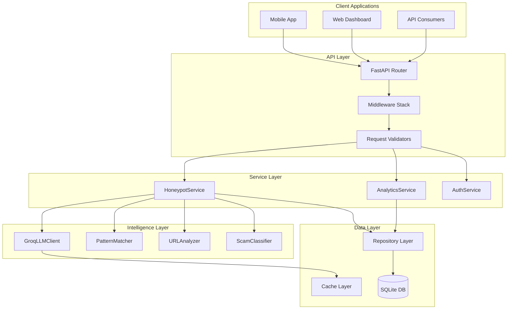
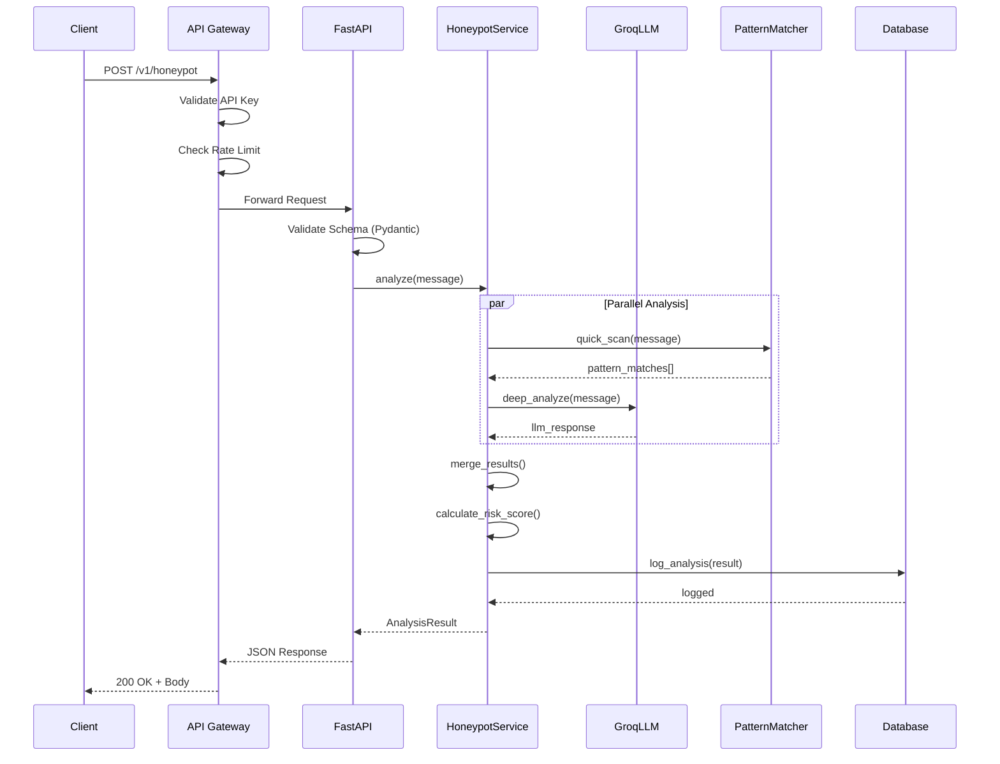
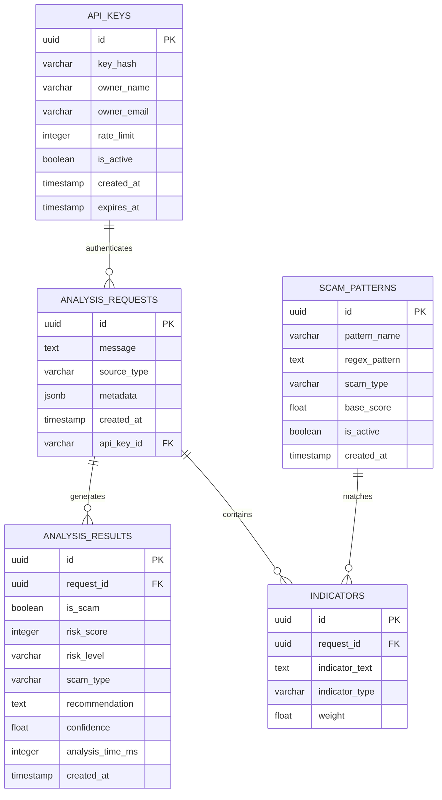

# 🏗️ Architecture Documentation

> ScamShield Honeypot API — System Architecture & Design

---

## Table of Contents

- [System Overview](#system-overview)
- [Component Architecture](#component-architecture)
- [Data Flow](#data-flow)
- [Database Schema](#database-schema)
- [API Design](#api-design)
- [Security Considerations](#security-considerations)
- [Scalability Strategy](#scalability-strategy)

---

## System Overview

ScamShield Honeypot API is designed as a **stateless, horizontally scalable** microservice that provides real-time scam detection capabilities. The architecture follows **clean architecture principles** with clear separation of concerns.

### High-Level Architecture

```
┌─────────────────────────────────────────────────────────────────────────────┐
│                              CLIENT LAYER                                    │
├─────────────────────────────────────────────────────────────────────────────┤
│  Mobile Apps  │  Web Dashboards  │  Third-Party Integrations  │  CLI Tools  │
└───────┬───────┴────────┬─────────┴──────────────┬─────────────┴──────┬──────┘
        │                │                        │                    │
        └────────────────┴────────────────────────┴────────────────────┘
                                    │
                                    ▼
┌─────────────────────────────────────────────────────────────────────────────┐
│                            API GATEWAY LAYER                                 │
├─────────────────────────────────────────────────────────────────────────────┤
│  Rate Limiting  │  Authentication  │  Request Validation  │  Load Balancing │
└───────────────────────────────────┬─────────────────────────────────────────┘
                                    │
                                    ▼
┌─────────────────────────────────────────────────────────────────────────────┐
│                           APPLICATION LAYER                                  │
├─────────────────────────────────────────────────────────────────────────────┤
│                         FastAPI Application                                  │
│  ┌──────────────┐  ┌──────────────┐  ┌──────────────┐  ┌──────────────┐     │
│  │   Honeypot   │  │   Analytics  │  │    Health    │  │    Admin     │     │
│  │   Service    │  │   Service    │  │   Service    │  │   Service    │     │
│  └──────┬───────┘  └──────┬───────┘  └──────────────┘  └──────────────┘     │
└─────────┼─────────────────┼─────────────────────────────────────────────────┘
          │                 │
          ▼                 ▼
┌─────────────────────────────────────────────────────────────────────────────┐
│                          INTELLIGENCE LAYER                                  │
├─────────────────────────────────────────────────────────────────────────────┤
│  ┌────────────────────┐  ┌────────────────────┐  ┌────────────────────┐     │
│  │   Groq LLM Client  │  │  Pattern Matcher   │  │  URL Analyzer      │     │
│  │   (LLaMA 3.2)      │  │  (Rule Engine)     │  │  (Domain Intel)    │     │
│  └────────────────────┘  └────────────────────┘  └────────────────────┘     │
└─────────────────────────────────────────────────────────────────────────────┘
                                    │
                                    ▼
┌─────────────────────────────────────────────────────────────────────────────┐
│                            DATA LAYER                                        │
├─────────────────────────────────────────────────────────────────────────────┤
│  ┌────────────────────┐  ┌────────────────────┐  ┌────────────────────┐     │
│  │   SQLite Database  │  │   Scam Patterns    │  │    Threat Intel    │     │
│  │   (Persistence)    │  │   (Cache)          │  │    (Feed Store)    │     │
│  └────────────────────┘  └────────────────────┘  └────────────────────┘     │
└─────────────────────────────────────────────────────────────────────────────┘
```

### Design Principles

| Principle | Implementation |
|-----------|----------------|
| **Single Responsibility** | Each service handles one domain (detection, analytics, admin) |
| **Dependency Inversion** | Core logic depends on abstractions, not concrete implementations |
| **Open/Closed** | New scam types can be added without modifying existing code |
| **Stateless Design** | No server-side session; all state in database |
| **Fail-Safe Defaults** | Unknown messages default to "review required" not "safe" |

---

## Component Architecture



### Component Descriptions

| Component | Responsibility | Technology |
|-----------|----------------|------------|
| **FastAPI Router** | HTTP request routing and OpenAPI docs | FastAPI |
| **Middleware Stack** | CORS, logging, error handling, timing | Starlette |
| **Request Validators** | Input sanitization and schema validation | Pydantic |
| **HoneypotService** | Core scam detection orchestration | Python |
| **AnalyticsService** | Aggregation and reporting | Python |
| **AuthService** | API key validation and rate limiting | Python |
| **GroqLLMClient** | LLM API communication | httpx/aiohttp |
| **PatternMatcher** | Regex-based quick detection | Python re |
| **URLAnalyzer** | Domain reputation and URL parsing | urllib/tldextract |
| **ScamClassifier** | Final classification logic | Python |
| **Repository Layer** | Database abstraction (CRUD) | SQLAlchemy |
| **Cache Layer** | Response caching for repeated queries | Python dict/Redis |

---

## Data Flow

### Request → Response Lifecycle



### Analysis Pipeline

```
┌─────────────┐    ┌─────────────┐    ┌─────────────┐    ┌─────────────┐
│   INPUT     │    │   STAGE 1   │    │   STAGE 2   │    │   STAGE 3   │
│   Message   │───▶│   Pattern   │───▶│   LLM       │───▶│   Score     │
│             │    │   Matching  │    │   Analysis  │    │   Fusion    │
└─────────────┘    └─────────────┘    └─────────────┘    └─────────────┘
                          │                  │                  │
                          ▼                  ▼                  ▼
                   ┌─────────────┐    ┌─────────────┐    ┌─────────────┐
                   │ Known Scam  │    │ Semantic    │    │ Final Risk  │
                   │ Patterns    │    │ Analysis    │    │ Assessment  │
                   │ (Fast Path) │    │ (Deep Path) │    │ (Output)    │
                   └─────────────┘    └─────────────┘    └─────────────┘
```

### Stage Descriptions

| Stage | Latency | Purpose |
|-------|---------|---------|
| **Pattern Matching** | < 5ms | Quick regex scan for known scam patterns |
| **LLM Analysis** | 100-300ms | Deep semantic analysis with Groq/LLaMA |
| **Score Fusion** | < 2ms | Weighted combination of all signals |

---

## Database Schema

### Entity Relationship Diagram



### Table Definitions

#### `analysis_requests`
| Column | Type | Constraints | Description |
|--------|------|-------------|-------------|
| `id` | UUID | PRIMARY KEY | Unique request identifier |
| `message` | TEXT | NOT NULL | Original message content |
| `source_type` | VARCHAR(20) | NOT NULL | sms, whatsapp, email, voice |
| `metadata` | JSONB | NULLABLE | Additional context (sender, region) |
| `created_at` | TIMESTAMP | DEFAULT NOW() | Request timestamp |
| `api_key_id` | UUID | FOREIGN KEY | Reference to API key used |

#### `analysis_results`
| Column | Type | Constraints | Description |
|--------|------|-------------|-------------|
| `id` | UUID | PRIMARY KEY | Unique result identifier |
| `request_id` | UUID | FOREIGN KEY | Reference to request |
| `is_scam` | BOOLEAN | NOT NULL | Binary classification |
| `risk_score` | INTEGER | CHECK (0-100) | Numerical risk score |
| `risk_level` | VARCHAR(20) | NOT NULL | SAFE, LOW, MEDIUM, HIGH, CRITICAL |
| `scam_type` | VARCHAR(50) | NULLABLE | Classification category |
| `recommendation` | TEXT | NOT NULL | User-facing advice |
| `confidence` | FLOAT | CHECK (0-1) | Model confidence |
| `analysis_time_ms` | INTEGER | NOT NULL | Processing duration |

#### `api_keys`
| Column | Type | Constraints | Description |
|--------|------|-------------|-------------|
| `id` | UUID | PRIMARY KEY | Key identifier |
| `key_hash` | VARCHAR(64) | UNIQUE, NOT NULL | SHA-256 hash of API key |
| `owner_name` | VARCHAR(100) | NOT NULL | Key owner name |
| `owner_email` | VARCHAR(255) | NOT NULL | Contact email |
| `rate_limit` | INTEGER | DEFAULT 100 | Requests per minute |
| `is_active` | BOOLEAN | DEFAULT TRUE | Key status |
| `expires_at` | TIMESTAMP | NULLABLE | Optional expiration |

#### `scam_patterns`
| Column | Type | Constraints | Description |
|--------|------|-------------|-------------|
| `id` | UUID | PRIMARY KEY | Pattern identifier |
| `pattern_name` | VARCHAR(100) | NOT NULL | Human-readable name |
| `regex_pattern` | TEXT | NOT NULL | Regex pattern |
| `scam_type` | VARCHAR(50) | NOT NULL | Category |
| `base_score` | FLOAT | CHECK (0-100) | Base risk contribution |
| `is_active` | BOOLEAN | DEFAULT TRUE | Pattern status |

---

## API Design

### Endpoint Overview

| Method | Endpoint | Description | Auth |
|--------|----------|-------------|------|
| `POST` | `/v1/honeypot` | Analyze message for scams | API Key |
| `GET` | `/v1/honeypot/{id}` | Retrieve analysis result | API Key |
| `GET` | `/v1/analytics/summary` | Aggregated statistics | API Key |
| `GET` | `/v1/analytics/trends` | Scam trend data | API Key |
| `GET` | `/health` | Service health check | None |
| `GET` | `/docs` | OpenAPI documentation | None |

### REST Conventions

| Aspect | Convention |
|--------|------------|
| **Versioning** | URI prefix (`/v1/`) |
| **Naming** | Lowercase, hyphen-separated |
| **Methods** | POST for actions, GET for retrieval |
| **Status Codes** | 200 OK, 201 Created, 400 Bad Request, 401 Unauthorized, 429 Too Many Requests, 500 Internal Error |
| **Content Type** | `application/json` |
| **Error Format** | `{"error": {"code": "...", "message": "...", "details": {}}}` |

---

## Security Considerations

### 🔐 Authentication & Authorization

| Control | Implementation |
|---------|----------------|
| **API Key Authentication** | Required `X-API-Key` header for all protected endpoints |
| **Key Hashing** | SHA-256 hashing of keys at rest |
| **Key Rotation** | Support for key expiration and regeneration |
| **Scope Limitation** | Keys can be scoped to specific endpoints |

### 🛡️ Input Validation & Sanitization

| Control | Implementation |
|---------|----------------|
| **Schema Validation** | Pydantic models enforce strict typing |
| **Size Limits** | Maximum message length: 10,000 characters |
| **Content Filtering** | Strip executable content, sanitize HTML |
| **SQL Injection Prevention** | Parameterized queries via SQLAlchemy ORM |

### 🚦 Rate Limiting & Abuse Prevention

| Control | Implementation |
|---------|----------------|
| **Per-Key Limits** | Configurable RPM (requests per minute) |
| **Global Limits** | Burst protection at gateway level |
| **Sliding Window** | Token bucket algorithm for smooth limiting |
| **Abuse Detection** | Flag repeated identical requests |

### 🔒 Data Protection

| Control | Implementation |
|---------|----------------|
| **TLS Enforcement** | HTTPS-only in production |
| **PII Minimization** | Hash/truncate phone numbers in logs |
| **Retention Policy** | Auto-delete analysis data after 90 days |
| **Encryption at Rest** | SQLite encryption extension (optional) |

### 📋 Logging & Monitoring

| Control | Implementation |
|---------|----------------|
| **Structured Logging** | JSON format with correlation IDs |
| **Audit Trail** | Log all API key usage |
| **Anomaly Detection** | Alert on unusual request patterns |
| **No Sensitive Data** | Never log full messages or API keys |

---

## Scalability Strategy

### Horizontal Scaling

```
                    ┌─────────────┐
                    │   Load      │
                    │   Balancer  │
                    └──────┬──────┘
                           │
           ┌───────────────┼───────────────┐
           │               │               │
           ▼               ▼               ▼
    ┌─────────────┐ ┌─────────────┐ ┌─────────────┐
    │  Instance 1 │ │  Instance 2 │ │  Instance N │
    │  (FastAPI)  │ │  (FastAPI)  │ │  (FastAPI)  │
    └──────┬──────┘ └──────┬──────┘ └──────┬──────┘
           │               │               │
           └───────────────┴───────────────┘
                           │
                    ┌──────┴──────┐
                    │   Shared    │
                    │   Database  │
                    └─────────────┘
```

### Performance Targets

| Metric | Target | Current |
|--------|--------|---------|
| **P50 Latency** | < 200ms | TBD |
| **P99 Latency** | < 500ms | TBD |
| **Throughput** | 1000 RPM | TBD |
| **Availability** | 99.9% | TBD |

---

<p align="center">
  <em>Architecture designed for reliability, security, and scale.</em>
</p>
