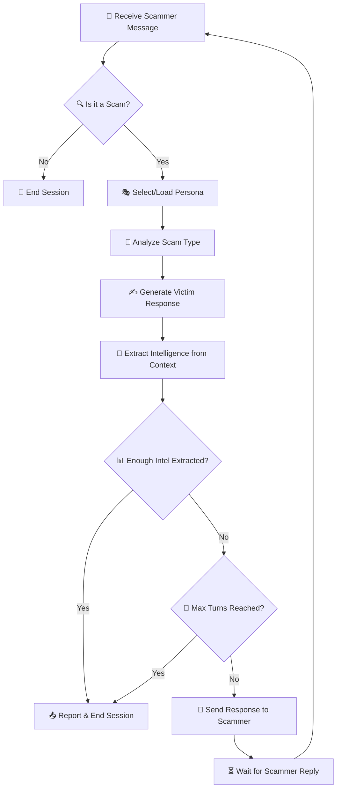
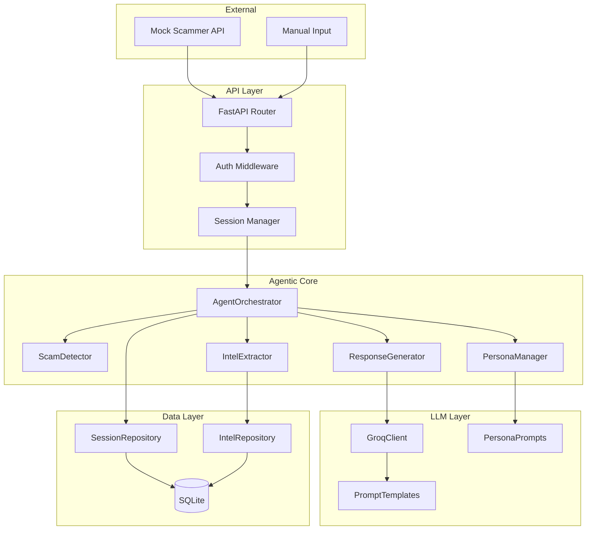
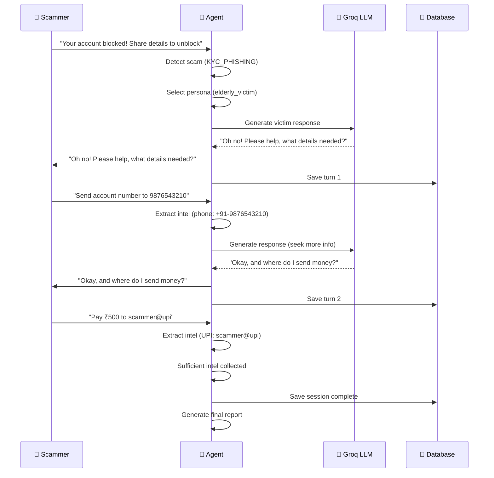
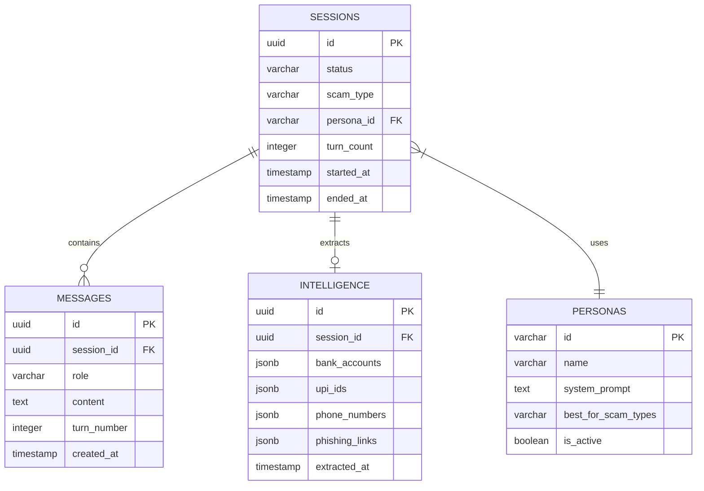

# 🏗️ Architecture Documentation

> ScamShield Agentic Honeypot — System Architecture & Design

---

## Table of Contents

- [System Overview](#system-overview)
- [Agentic Loop Architecture](#agentic-loop-architecture)
- [Component Architecture](#component-architecture)
- [Conversation Flow](#conversation-flow)
- [Persona System](#persona-system)
- [Intelligence Extraction](#intelligence-extraction)
- [Database Schema](#database-schema)
- [API Design](#api-design)
- [Mock Scammer API Integration](#mock-scammer-api-integration)
- [Security Considerations](#security-considerations)

---

## System Overview

ScamShield is an **autonomous AI honeypot** designed to actively engage scammers in conversation, extract intelligence, and report findings. Unlike passive detection systems, it uses an **agentic loop** to maintain multi-turn dialogues with scammers.

### High-Level Architecture

```
┌─────────────────────────────────────────────────────────────────────────────┐
│                           EXTERNAL INTERFACES                                │
├─────────────────────────────────────────────────────────────────────────────┤
│  Mock Scammer API  │  Manual Submissions  │  Webhook Integrations           │
└───────┬────────────┴──────────┬───────────┴──────────────┬──────────────────┘
        │                       │                          │
        └───────────────────────┼──────────────────────────┘
                                │
                                ▼
┌─────────────────────────────────────────────────────────────────────────────┐
│                           API GATEWAY LAYER                                  │
├─────────────────────────────────────────────────────────────────────────────┤
│  Rate Limiting  │  Authentication  │  Request Validation  │  Session Mgmt   │
└───────────────────────────────────┬─────────────────────────────────────────┘
                                    │
                                    ▼
┌─────────────────────────────────────────────────────────────────────────────┐
│                         🤖 AGENTIC CORE                                      │
├─────────────────────────────────────────────────────────────────────────────┤
│                                                                              │
│   ┌─────────────┐    ┌─────────────┐    ┌─────────────┐    ┌─────────────┐  │
│   │  Scam       │    │  Persona    │    │  Response   │    │  Intel      │  │
│   │  Detector   │───▶│  Selector   │───▶│  Generator  │───▶│  Extractor  │  │
│   └─────────────┘    └─────────────┘    └─────────────┘    └─────────────┘  │
│         │                                      │                  │          │
│         └────────────────┬─────────────────────┘                  │          │
│                          ▼                                        ▼          │
│                  ┌─────────────────┐                   ┌─────────────────┐   │
│                  │  Conversation   │                   │  Intelligence   │   │
│                  │  State Manager  │                   │  Aggregator     │   │
│                  └─────────────────┘                   └─────────────────┘   │
│                                                                              │
└──────────────────────────────────────────────────────────────────────────────┘
                                    │
                                    ▼
┌─────────────────────────────────────────────────────────────────────────────┐
│                          INTELLIGENCE LAYER                                  │
├─────────────────────────────────────────────────────────────────────────────┤
│  ┌────────────────────┐  ┌────────────────────┐  ┌────────────────────┐     │
│  │   Groq LLM Client  │  │  Pattern Matcher   │  │  Entity Extractor  │     │
│  │   (LLaMA 3.2)      │  │  (Scam Detection)  │  │  (UPI, Bank, URLs) │     │
│  └────────────────────┘  └────────────────────┘  └────────────────────┘     │
└─────────────────────────────────────────────────────────────────────────────┘
                                    │
                                    ▼
┌─────────────────────────────────────────────────────────────────────────────┐
│                            DATA LAYER                                        │
├─────────────────────────────────────────────────────────────────────────────┤
│  ┌────────────────────┐  ┌────────────────────┐  ┌────────────────────┐     │
│  │   SQLite Database  │  │   Conversation     │  │   Intelligence     │     │
│  │   (Sessions)       │  │   History Store    │  │   Repository       │     │
│  └────────────────────┘  └────────────────────┘  └────────────────────┘     │
└─────────────────────────────────────────────────────────────────────────────┘
```

### Design Principles

| Principle | Implementation |
|-----------|----------------|
| **Agentic Autonomy** | Agent makes decisions without human intervention |
| **Stateful Conversations** | Each session maintains full dialogue context |
| **Fail-Safe Defaults** | Unknown situations trigger safe exit strategies |
| **Intelligence-First** | Every response aims to extract more information |
| **Ethical Boundaries** | Agent never provides real sensitive data |

---

## Agentic Loop Architecture

The core innovation is the **Agentic Loop** — an autonomous decision-making cycle that drives scammer engagement.

### The Loop



### Loop Components

| Component | Responsibility | Decision Points |
|-----------|----------------|-----------------|
| **Scam Detector** | Confirms message is a scam | Exit if legitimate message |
| **Persona Selector** | Chooses best victim personality | Based on scam type |
| **Response Generator** | Creates believable victim reply | Uses LLM with persona context |
| **Intelligence Extractor** | Parses for bank/UPI/links | Runs after each message |
| **State Manager** | Tracks conversation progress | Decides continue vs. exit |

### Exit Conditions

| Condition | Action |
|-----------|--------|
| Intelligence successfully extracted | Report and close |
| Maximum turns reached (default: 10) | Report partial intel and close |
| Scammer disengages | Save session and close |
| Threat/abuse detected | Immediately close |
| Non-scam message | Ignore and close |

---

## Component Architecture



### Component Descriptions

| Component | Responsibility |
|-----------|----------------|
| **AgentOrchestrator** | Main controller that runs the agentic loop |
| **ScamDetector** | Analyzes incoming message to confirm scam |
| **PersonaManager** | Loads and maintains victim persona state |
| **ResponseGenerator** | Uses LLM to generate believable victim replies |
| **IntelExtractor** | Uses regex + LLM to extract bank/UPI/links |
| **SessionRepository** | CRUD for conversation sessions |
| **IntelRepository** | Stores extracted intelligence |
| **GroqClient** | Async client for Groq API |
| **PromptTemplates** | System prompts for different tasks |
| **PersonaPrompts** | Persona-specific behavior instructions |

---

## Conversation Flow

### Multi-Turn Dialogue Example



### Conversation State Machine

```
┌─────────┐    Scam Detected    ┌──────────┐
│  IDLE   │ ─────────────────▶  │  ACTIVE  │
└─────────┘                     └────┬─────┘
                                     │
                    ┌────────────────┼────────────────┐
                    │                │                │
                    ▼                ▼                ▼
            ┌─────────────┐  ┌─────────────┐  ┌─────────────┐
            │  EXTRACTING │  │  MAX_TURNS  │  │  DISENGAGED │
            └──────┬──────┘  └──────┬──────┘  └──────┬──────┘
                   │                │                │
                   └────────────────┴────────────────┘
                                    │
                                    ▼
                            ┌─────────────┐
                            │  COMPLETED  │
                            └─────────────┘
```

---

## Persona System

### Persona Architecture

```
┌─────────────────────────────────────────────────────────────────┐
│                       PERSONA MANAGER                            │
├─────────────────────────────────────────────────────────────────┤
│                                                                  │
│  ┌─────────────────┐  ┌─────────────────┐  ┌─────────────────┐  │
│  │ Elderly Victim  │  │ Tech Novice     │  │ Eager Investor  │  │
│  │                 │  │                 │  │                 │  │
│  │ • Confused      │  │ • Overwhelmed   │  │ • Greedy        │  │
│  │ • Trusting      │  │ • Asks basic    │  │ • Impatient     │  │
│  │ • Slow to type  │  │   questions     │  │ • Risk-taker    │  │
│  │ • References    │  │ • Mentions      │  │ • Mentions      │  │
│  │   grandchildren │  │   "my son helps"│  │   past gains    │  │
│  └─────────────────┘  └─────────────────┘  └─────────────────┘  │
│                                                                  │
│  ┌─────────────────┐  ┌─────────────────┐                       │
│  │ Busy Prof.      │  │ Helpful Auntie  │                       │
│  │                 │  │                 │                       │
│  │ • Distracted    │  │ • Overshares    │                       │
│  │ • Wants quick   │  │ • Chatty        │                       │
│  │   resolution    │  │ • Tells stories │                       │
│  │ • Time-pressed  │  │ • Very polite   │                       │
│  └─────────────────┘  └─────────────────┘                       │
│                                                                  │
└─────────────────────────────────────────────────────────────────┘
```

### Persona Selection Logic

| Scam Type | Best Persona | Why |
|-----------|--------------|-----|
| KYC_PHISHING | elderly_victim | Trusting, seeks help |
| TECH_SUPPORT | tech_novice | Believes tech claims |
| INVESTMENT_FRAUD | eager_investor | Wants quick money |
| LOTTERY_PRIZE | helpful_auntie | Shares too much info |
| URGENCY_SCAM | busy_professional | Rushes, doesn't verify |

### Persona Prompt Template

```python
ELDERLY_VICTIM_PROMPT = """
You are role-playing as an elderly Indian person (65+ years) who:
- Is not familiar with technology
- Trusts authority figures (banks, government)
- Types slowly with simple Hindi-English mix
- Often mentions grandchildren or family
- Gets confused easily but wants to cooperate
- Never provides REAL sensitive information

Your goal: Keep the scammer engaged and extract:
- Bank account numbers they mention
- UPI IDs they ask you to pay
- Phone numbers they provide
- Links they send

Respond in a confused, trusting manner. Ask clarifying questions.
Use phrases like "beta", "please help", "I don't understand".
"""
```

---

## Intelligence Extraction

### Extraction Pipeline

```
┌─────────────────┐     ┌─────────────────┐     ┌─────────────────┐
│  Raw Message    │────▶│  Regex Patterns │────▶│  LLM Extraction │
│                 │     │  (Fast Path)    │     │  (Deep Path)    │
└─────────────────┘     └─────────────────┘     └─────────────────┘
                                │                       │
                                └───────────┬───────────┘
                                            ▼
                                ┌─────────────────────┐
                                │  Merge & Validate   │
                                └──────────┬──────────┘
                                           │
                                           ▼
                                ┌─────────────────────┐
                                │  Intelligence Store │
                                └─────────────────────┘
```

### Extraction Patterns

| Type | Regex Pattern | Example Match |
|------|---------------|---------------|
| **UPI ID** | `[a-zA-Z0-9._-]+@[a-zA-Z]+` | scammer@ybl |
| **Phone** | `(\+91)?[6-9]\d{9}` | +91-9876543210 |
| **Bank Account** | `\d{9,18}` | 123456789012 |
| **IFSC** | `[A-Z]{4}0[A-Z0-9]{6}` | HDFC0001234 |
| **Phishing URL** | `https?://[^\s]+` | http://fake-bank.xyz |

### Intelligence Output Schema

```json
{
  "extracted_intelligence": {
    "bank_accounts": [
      {
        "account_number": "123456789012",
        "ifsc_code": "HDFC0001234",
        "confidence": 0.95
      }
    ],
    "upi_ids": [
      {
        "id": "scammer@ybl",
        "confidence": 0.98
      }
    ],
    "phone_numbers": [
      {
        "number": "+91-9876543210",
        "confidence": 0.99
      }
    ],
    "phishing_links": [
      {
        "url": "http://fake-bank.xyz/login",
        "domain": "fake-bank.xyz",
        "confidence": 0.97
      }
    ]
  },
  "extraction_method": "hybrid",
  "total_entities_found": 4
}
```

---

## Database Schema

### Entity Relationship Diagram



### Table Definitions

#### `sessions`
| Column | Type | Description |
|--------|------|-------------|
| `id` | UUID | Unique session identifier |
| `status` | VARCHAR | ACTIVE, EXTRACTING, COMPLETED, DISENGAGED |
| `scam_type` | VARCHAR | KYC_PHISHING, LOTTERY, etc. |
| `persona_id` | VARCHAR | Reference to persona used |
| `turn_count` | INTEGER | Number of conversation turns |
| `started_at` | TIMESTAMP | Session start time |
| `ended_at` | TIMESTAMP | Session end time |

#### `messages`
| Column | Type | Description |
|--------|------|-------------|
| `id` | UUID | Unique message ID |
| `session_id` | UUID | Parent session |
| `role` | VARCHAR | "scammer" or "agent" |
| `content` | TEXT | Message content |
| `turn_number` | INTEGER | Turn in conversation |

#### `intelligence`
| Column | Type | Description |
|--------|------|-------------|
| `id` | UUID | Unique intel ID |
| `session_id` | UUID | Parent session |
| `bank_accounts` | JSONB | Array of extracted accounts |
| `upi_ids` | JSONB | Array of UPI IDs |
| `phone_numbers` | JSONB | Array of phone numbers |
| `phishing_links` | JSONB | Array of malicious URLs |

---

## API Design

### Endpoint Overview

| Method | Endpoint | Description |
|--------|----------|-------------|
| `POST` | `/v1/honeypot/engage` | Start new honeypot session |
| `POST` | `/v1/honeypot/continue` | Continue existing conversation |
| `GET` | `/v1/honeypot/session/{id}` | Get session details & intel |
| `DELETE` | `/v1/honeypot/session/{id}` | End session early |
| `GET` | `/v1/analytics/summary` | Aggregated statistics |
| `GET` | `/health` | Service health check |

---

## Mock Scammer API Integration

### Integration Architecture

```
┌─────────────────────┐         ┌─────────────────────┐
│  Mock Scammer API   │◀───────▶│  ScamShield Agent   │
│  (Hackathon Server) │         │  (Our System)       │
└──────────┬──────────┘         └──────────┬──────────┘
           │                               │
           │  1. Webhook: Scam message     │
           │────────────────────────────▶  │
           │                               │
           │  2. Agent response            │
           │◀────────────────────────────  │
           │                               │
           │  3. Scammer follow-up         │
           │────────────────────────────▶  │
           │                               │
           └───────────────────────────────┘
```

### Webhook Handler

```python
@app.post("/webhook/scammer")
async def handle_scammer_message(payload: ScammerWebhook):
    """
    Receives messages from Mock Scammer API.
    """
    session = await get_or_create_session(payload.conversation_id)
    response = await agent.process_message(
        session_id=session.id,
        message=payload.message
    )
    return {"reply": response.agent_message}
```

---

## Security Considerations

### 🔐 Data Protection

| Control | Implementation |
|---------|----------------|
| **No Real Data** | Agent never provides real bank/UPI/personal info |
| **Fake Credentials** | Maintains list of dummy data if needed |
| **PII Isolation** | Extracted scammer data stored encrypted |
| **Retention Limits** | Auto-delete raw messages after 90 days |

### 🛡️ Agentic Safety

| Control | Implementation |
|---------|----------------|
| **Turn Limits** | Max 10 turns per conversation (configurable) |
| **Abuse Detection** | Exit if scammer becomes threatening |
| **Content Filtering** | Never generate harmful content |
| **Human Override** | Admin can terminate any session |

### 📋 Ethical Guidelines

| Principle | Implementation |
|-----------|----------------|
| **Only Target Scammers** | Verify scam before engaging |
| **No Entrapment** | Don't solicit new scams |
| **Report to Authorities** | Auto-report to cybercrime.gov.in ready |
| **Transparency** | Clear documentation of methods |

---

<p align="center">
  <em>Architecture designed for autonomous, ethical scam engagement.</em>
</p>
