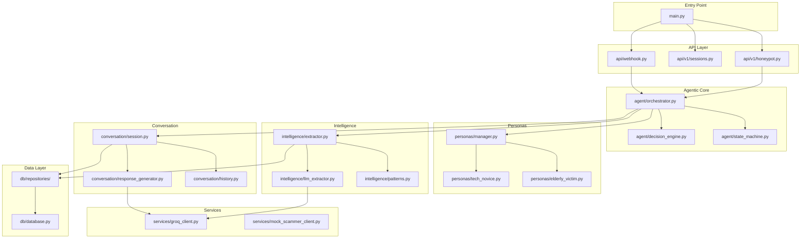

# 📁 Project Structure

> ScamShield Agentic Honeypot — Codebase Organization

---

## Directory Tree

```
scamshield-honeypot/
├── 📁 app/                              # Main application package
│   ├── 📄 __init__.py                   # Package initializer
│   ├── 📄 main.py                       # FastAPI application entry point
│   ├── 📄 config.py                     # Configuration management
│   ├── 📄 dependencies.py               # Dependency injection
│   │
│   ├── 📁 api/                          # API layer
│   │   ├── 📄 __init__.py
│   │   ├── 📁 v1/                       # API version 1
│   │   │   ├── 📄 __init__.py
│   │   │   ├── 📄 router.py             # Version router aggregator
│   │   │   ├── 📄 honeypot.py           # Honeypot engagement endpoints
│   │   │   ├── 📄 sessions.py           # Session management endpoints
│   │   │   ├── 📄 analytics.py          # Analytics endpoints
│   │   │   └── 📄 health.py             # Health check endpoints
│   │   ├── 📄 webhook.py                # Mock Scammer API webhook handler
│   │   └── 📄 deps.py                   # API-level dependencies
│   │
│   ├── 📁 agent/                        # 🤖 AGENTIC CORE (NEW)
│   │   ├── 📄 __init__.py
│   │   ├── 📄 orchestrator.py           # Main agent loop controller
│   │   ├── 📄 state_machine.py          # Conversation state management
│   │   ├── 📄 decision_engine.py        # Continue/exit decision logic
│   │   └── 📄 safety.py                 # Safety checks and limits
│   │
│   ├── 📁 personas/                     # 🎭 PERSONA SYSTEM (NEW)
│   │   ├── 📄 __init__.py
│   │   ├── 📄 manager.py                # Persona selection and loading
│   │   ├── 📄 base.py                   # Base persona class
│   │   ├── 📄 elderly_victim.py         # Elderly victim persona
│   │   ├── 📄 tech_novice.py            # Tech novice persona
│   │   ├── 📄 eager_investor.py         # Eager investor persona
│   │   ├── 📄 busy_professional.py      # Busy professional persona
│   │   └── 📄 helpful_auntie.py         # Helpful auntie persona
│   │
│   ├── 📁 intelligence/                 # 🔍 INTEL EXTRACTION (NEW)
│   │   ├── 📄 __init__.py
│   │   ├── 📄 extractor.py              # Main extraction orchestrator
│   │   ├── 📄 patterns.py               # Regex patterns for UPI, bank, etc.
│   │   ├── 📄 llm_extractor.py          # LLM-based entity extraction
│   │   ├── 📄 validators.py             # Validate extracted entities
│   │   └── 📄 aggregator.py             # Merge and dedupe intel
│   │
│   ├── 📁 conversation/                 # 💬 CONVERSATION MGMT (NEW)
│   │   ├── 📄 __init__.py
│   │   ├── 📄 session.py                # Session lifecycle management
│   │   ├── 📄 history.py                # Conversation history tracking
│   │   ├── 📄 context.py                # Context window management
│   │   └── 📄 response_generator.py     # LLM response generation
│   │
│   ├── 📁 scam_detection/               # 🔎 SCAM DETECTION
│   │   ├── 📄 __init__.py
│   │   ├── 📄 detector.py               # Main scam detection logic
│   │   ├── 📄 classifier.py             # Scam type classification
│   │   └── 📄 patterns.py               # Known scam patterns
│   │
│   ├── 📁 services/                     # External service integrations
│   │   ├── 📄 __init__.py
│   │   ├── 📄 groq_client.py            # Groq LLM API client
│   │   ├── 📄 mock_scammer_client.py    # Mock Scammer API client (NEW)
│   │   └── 📄 cache.py                  # Caching service
│   │
│   ├── 📁 models/                       # Pydantic models (schemas)
│   │   ├── 📄 __init__.py
│   │   ├── 📄 requests.py               # API request schemas
│   │   ├── 📄 responses.py              # API response schemas
│   │   ├── 📄 session.py                # Session models
│   │   ├── 📄 intelligence.py           # Intelligence data models
│   │   ├── 📄 conversation.py           # Conversation/message models
│   │   └── 📄 errors.py                 # Error response models
│   │
│   ├── 📁 db/                           # Database layer
│   │   ├── 📄 __init__.py
│   │   ├── 📄 database.py               # Database connection setup
│   │   ├── 📄 models.py                 # SQLAlchemy ORM models
│   │   └── 📁 repositories/             # Data access layer
│   │       ├── 📄 __init__.py
│   │       ├── 📄 base.py               # Base repository class
│   │       ├── 📄 sessions.py           # Session CRUD operations
│   │       ├── 📄 messages.py           # Message history operations
│   │       └── 📄 intelligence.py       # Intelligence storage
│   │
│   ├── 📁 middleware/                   # Custom middleware
│   │   ├── 📄 __init__.py
│   │   ├── 📄 auth.py                   # API key authentication
│   │   ├── 📄 rate_limit.py             # Rate limiting middleware
│   │   ├── 📄 logging.py                # Request/response logging
│   │   └── 📄 timing.py                 # Request timing
│   │
│   └── 📁 utils/                        # Utility functions
│       ├── 📄 __init__.py
│       ├── 📄 text.py                   # Text preprocessing
│       ├── 📄 validators.py             # Custom validators
│       └── 📄 constants.py              # Application constants
│
├── 📁 prompts/                          # 📝 LLM PROMPTS (NEW)
│   ├── 📄 system/                       # System prompts
│   │   ├── 📄 scam_detector.txt         # Scam detection prompt
│   │   ├── 📄 intel_extractor.txt       # Intelligence extraction prompt
│   │   └── 📄 response_generator.txt    # Response generation prompt
│   └── 📄 personas/                     # Persona-specific prompts
│       ├── 📄 elderly_victim.txt
│       ├── 📄 tech_novice.txt
│       ├── 📄 eager_investor.txt
│       ├── 📄 busy_professional.txt
│       └── 📄 helpful_auntie.txt
│
├── 📁 data/                             # Static data files
│   ├── 📄 scam_patterns.json            # Known scam regex patterns
│   ├── 📄 suspicious_domains.txt        # Blocked domain list
│   ├── 📄 upi_handle_patterns.json      # Valid UPI handle formats
│   └── 📄 bank_codes.json               # IFSC code mappings
│
├── 📁 tests/                            # Test suite
│   ├── 📄 __init__.py
│   ├── 📄 conftest.py                   # Pytest fixtures
│   ├── 📁 unit/                         # Unit tests
│   │   ├── 📄 test_orchestrator.py      # Agent orchestrator tests
│   │   ├── 📄 test_personas.py          # Persona system tests
│   │   ├── 📄 test_extractor.py         # Intelligence extraction tests
│   │   ├── 📄 test_detector.py          # Scam detection tests
│   │   └── 📄 test_state_machine.py     # State machine tests
│   ├── 📁 integration/                  # Integration tests
│   │   ├── 📄 test_api_engage.py        # Engage endpoint tests
│   │   ├── 📄 test_api_continue.py      # Continue endpoint tests
│   │   ├── 📄 test_full_conversation.py # End-to-end conversation tests
│   │   └── 📄 test_mock_scammer.py      # Mock Scammer API tests
│   └── 📁 fixtures/                     # Test data
│       ├── 📄 sample_scam_messages.json
│       ├── 📄 expected_extractions.json
│       └── 📄 conversation_flows.json
│
├── 📁 scripts/                          # Utility scripts
│   ├── 📄 init_db.py                    # Database initialization
│   ├── 📄 seed_patterns.py              # Seed scam patterns
│   ├── 📄 generate_api_key.py           # Generate API keys
│   └── 📄 test_conversation.py          # Manual conversation tester
│
├── 📁 docs/                             # Documentation
│   ├── 📄 ARCHITECTURE.md               # System architecture
│   ├── 📄 API_DOCUMENTATION.md          # API reference
│   ├── 📄 DEPLOYMENT.md                 # Deployment guide
│   └── 📄 PROJECT_STRUCTURE.md          # This file
│
├── 📄 README.md                         # Project overview (root)
├── 📄 .env.example                      # Environment template
├── 📄 .gitignore                        # Git ignore rules
├── 📄 pyproject.toml                    # Project metadata & deps
├── 📄 requirements.txt                  # Pip requirements
├── 📄 Dockerfile                        # Container definition
├── 📄 docker-compose.yml                # Local dev compose
├── 📄 render.yaml                       # Render.com config
└── 📄 LICENSE                           # MIT License
```

---

## New Agentic Components

### 🤖 Agent Module (`app/agent/`)

The brain of the honeypot — manages autonomous conversation flow.

| File | Purpose |
|------|---------|
| `orchestrator.py` | Main agentic loop - coordinates all components |
| `state_machine.py` | Tracks conversation state (ONGOING → COMPLETED) |
| `decision_engine.py` | Decides: continue, extract, or exit |
| `safety.py` | Enforces turn limits, blocks threats |

### 🎭 Personas Module (`app/personas/`)

Believable victim personalities for scammer engagement.

| File | Purpose |
|------|---------|
| `manager.py` | Selects optimal persona based on scam type |
| `base.py` | Abstract base class for all personas |
| `elderly_victim.py` | Confused, trusting elderly person |
| `tech_novice.py` | Technology-challenged user |
| `eager_investor.py` | Greedy quick-money seeker |
| `busy_professional.py` | Distracted, time-pressured |
| `helpful_auntie.py` | Overshares, very polite |

### 🔍 Intelligence Module (`app/intelligence/`)

Extracts actionable data from scammer messages.

| File | Purpose |
|------|---------|
| `extractor.py` | Orchestrates extraction pipeline |
| `patterns.py` | Regex for UPI IDs, bank accounts, phones, URLs |
| `llm_extractor.py` | LLM-based semantic extraction |
| `validators.py` | Validates extracted entities (format checks) |
| `aggregator.py` | Merges intel from multiple turns |

### 💬 Conversation Module (`app/conversation/`)

Manages multi-turn dialogue state.

| File | Purpose |
|------|---------|
| `session.py` | Session lifecycle (create, update, close) |
| `history.py` | Stores full conversation log |
| `context.py` | Builds LLM context from history |
| `response_generator.py` | Generates victim responses via Groq |

---

## Core File Descriptions

### Entry Point

| File | Purpose |
|------|---------|
| `app/main.py` | FastAPI initialization, middleware, routers |
| `app/config.py` | Pydantic settings from environment |

### API Endpoints

| File | Endpoints |
|------|-----------|
| `app/api/v1/honeypot.py` | `POST /engage`, `POST /continue` |
| `app/api/v1/sessions.py` | `GET /session/{id}`, `DELETE /session/{id}` |
| `app/api/webhook.py` | `POST /webhook/scammer` (Mock API) |
| `app/api/v1/health.py` | `GET /health` |

### Database

| File | Purpose |
|------|---------|
| `app/db/database.py` | SQLite connection, session factory |
| `app/db/models.py` | ORM models: Session, Message, Intelligence |
| `app/db/repositories/sessions.py` | Session CRUD |
| `app/db/repositories/messages.py` | Message history operations |
| `app/db/repositories/intelligence.py` | Intel storage & retrieval |

---

## Module Dependencies



---

## Environment Variables

| Variable | Required | Description | Example |
|----------|----------|-------------|---------|
| `GROQ_API_KEY` | ✅ | Groq API authentication | `gsk_abc123...` |
| `DATABASE_URL` | ❌ | SQLite path | `sqlite:///./data/scamshield.db` |
| `ENVIRONMENT` | ❌ | Runtime environment | `development`, `production` |
| `LOG_LEVEL` | ❌ | Logging verbosity | `DEBUG`, `INFO` |
| `MAX_TURNS` | ❌ | Max conversation turns | `10` |
| `DEFAULT_PERSONA` | ❌ | Default persona if auto fails | `elderly_victim` |
| `MOCK_SCAMMER_URL` | ❌ | Mock Scammer API base URL | `https://mock-scammer.hackathon.ai` |
| `CORS_ORIGINS` | ❌ | Allowed CORS origins | `["https://app.scamshield.in"]` |

---

## File Naming Conventions

| Type | Convention | Example |
|------|------------|---------|
| **Modules** | snake_case | `response_generator.py` |
| **Classes** | PascalCase | `AgentOrchestrator` |
| **Functions** | snake_case | `extract_intelligence()` |
| **Constants** | UPPER_SNAKE | `MAX_TURNS` |
| **Prompts** | snake_case.txt | `elderly_victim.txt` |

---

<p align="center"><em>Organized for agentic autonomy and maintainability</em></p>
