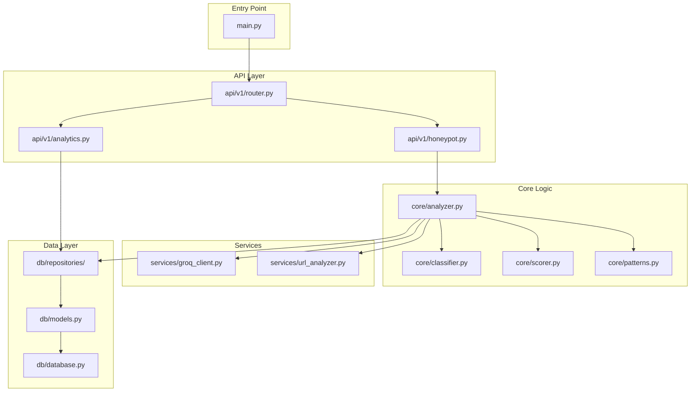

# 📁 Project Structure

> ScamShield Honeypot API — Codebase Organization

---

## Directory Tree

```
scamshield-honeypot/
├── 📁 app/                          # Main application package
│   ├── 📄 __init__.py               # Package initializer
│   ├── 📄 main.py                   # FastAPI application entry point
│   ├── 📄 config.py                 # Configuration management
│   ├── 📄 dependencies.py           # Dependency injection
│   │
│   ├── 📁 api/                      # API layer
│   │   ├── 📄 __init__.py
│   │   ├── 📁 v1/                   # API version 1
│   │   │   ├── 📄 __init__.py
│   │   │   ├── 📄 router.py         # Version router aggregator
│   │   │   ├── 📄 honeypot.py       # Honeypot analysis endpoints
│   │   │   ├── 📄 analytics.py      # Analytics endpoints
│   │   │   └── 📄 health.py         # Health check endpoints
│   │   └── 📄 deps.py               # API-level dependencies
│   │
│   ├── 📁 core/                     # Core business logic
│   │   ├── 📄 __init__.py
│   │   ├── 📄 analyzer.py           # Main analysis orchestrator
│   │   ├── 📄 classifier.py         # Scam classification logic
│   │   ├── 📄 scorer.py             # Risk score calculation
│   │   └── 📄 patterns.py           # Pattern matching engine
│   │
│   ├── 📁 services/                 # External service integrations
│   │   ├── 📄 __init__.py
│   │   ├── 📄 groq_client.py        # Groq LLM API client
│   │   ├── 📄 url_analyzer.py       # URL/domain analysis
│   │   └── 📄 cache.py              # Caching service
│   │
│   ├── 📁 models/                   # Pydantic models (schemas)
│   │   ├── 📄 __init__.py
│   │   ├── 📄 request.py            # Request schemas
│   │   ├── 📄 response.py           # Response schemas
│   │   ├── 📄 analysis.py           # Analysis result models
│   │   └── 📄 errors.py             # Error response models
│   │
│   ├── 📁 db/                       # Database layer
│   │   ├── 📄 __init__.py
│   │   ├── 📄 database.py           # Database connection setup
│   │   ├── 📄 models.py             # SQLAlchemy ORM models
│   │   └── 📁 repositories/         # Data access layer
│   │       ├── 📄 __init__.py
│   │       ├── 📄 base.py           # Base repository class
│   │       ├── 📄 analysis.py       # Analysis CRUD operations
│   │       └── 📄 api_keys.py       # API key management
│   │
│   ├── 📁 middleware/               # Custom middleware
│   │   ├── 📄 __init__.py
│   │   ├── 📄 auth.py               # API key authentication
│   │   ├── 📄 rate_limit.py         # Rate limiting middleware
│   │   ├── 📄 logging.py            # Request/response logging
│   │   └── 📄 timing.py             # Request timing
│   │
│   └── 📁 utils/                    # Utility functions
│       ├── 📄 __init__.py
│       ├── 📄 text.py               # Text preprocessing
│       ├── 📄 validators.py         # Custom validators
│       └── 📄 constants.py          # Application constants
│
├── 📁 data/                         # Static data files
│   ├── 📄 scam_patterns.json        # Known scam patterns
│   ├── 📄 suspicious_domains.txt    # Blocked domain list
│   └── 📄 prompts/                  # LLM prompt templates
│       └── 📄 analysis.txt          # Main analysis prompt
│
├── 📁 tests/                        # Test suite
│   ├── 📄 __init__.py
│   ├── 📄 conftest.py               # Pytest fixtures
│   ├── 📁 unit/                     # Unit tests
│   │   ├── 📄 test_analyzer.py
│   │   ├── 📄 test_classifier.py
│   │   └── 📄 test_patterns.py
│   ├── 📁 integration/              # Integration tests
│   │   ├── 📄 test_api.py
│   │   └── 📄 test_groq.py
│   └── 📁 fixtures/                 # Test data
│       └── 📄 sample_messages.json
│
├── 📁 scripts/                      # Utility scripts
│   ├── 📄 init_db.py                # Database initialization
│   ├── 📄 seed_patterns.py          # Seed scam patterns
│   └── 📄 generate_api_key.py       # Generate API keys
│
├── 📁 docs/                         # Documentation
│   ├── 📄 README.md                 # Project README
│   ├── 📄 ARCHITECTURE.md           # Architecture docs
│   ├── 📄 API_SPECIFICATION.md      # API specification
│   └── 📄 PROJECT_STRUCTURE.md      # This file
│
├── 📄 .env.example                  # Environment template
├── 📄 .gitignore                    # Git ignore rules
├── 📄 pyproject.toml                # Project metadata & deps
├── 📄 requirements.txt              # Pip requirements
├── 📄 Dockerfile                    # Container definition
├── 📄 docker-compose.yml            # Local dev compose
├── 📄 render.yaml                   # Render.com config
└── 📄 LICENSE                       # MIT License
```

---

## File Descriptions

### Root Configuration

| File | Purpose |
|------|---------|
| `.env.example` | Template for environment variables (copy to `.env`) |
| `pyproject.toml` | Modern Python project config with dependencies |
| `requirements.txt` | Pip-compatible dependency list |
| `Dockerfile` | Production container build instructions |
| `docker-compose.yml` | Local development with dependencies |
| `render.yaml` | Render.com deployment configuration |

---

### Application Core (`app/`)

| File | Purpose |
|------|---------|
| `main.py` | FastAPI app initialization, middleware setup, router mounting |
| `config.py` | Pydantic settings for environment variables |
| `dependencies.py` | Shared dependency injection (DB sessions, services) |

---

### API Layer (`app/api/`)

| File | Purpose |
|------|---------|
| `v1/router.py` | Aggregates all v1 endpoint routers |
| `v1/honeypot.py` | `POST /honeypot` and `GET /honeypot/{id}` |
| `v1/analytics.py` | `GET /analytics/summary` and trends |
| `v1/health.py` | `GET /health` service status |
| `deps.py` | API-specific dependencies (auth, pagination) |

---

### Business Logic (`app/core/`)

| File | Purpose |
|------|---------|
| `analyzer.py` | Main orchestrator - coordinates pattern matching, LLM, scoring |
| `classifier.py` | Determines scam type based on indicators |
| `scorer.py` | Calculates weighted risk score (0-100) |
| `patterns.py` | Regex-based quick detection for known scam patterns |

---

### External Services (`app/services/`)

| File | Purpose |
|------|---------|
| `groq_client.py` | Async client for Groq API with retry logic |
| `url_analyzer.py` | Domain reputation check, URL parsing |
| `cache.py` | In-memory/Redis caching for repeated queries |

---

### Data Models (`app/models/`)

| File | Purpose |
|------|---------|
| `request.py` | `HoneypotRequest`, `AnalyticsQuery` schemas |
| `response.py` | `HoneypotResponse`, `AnalyticsSummary` schemas |
| `analysis.py` | Internal `AnalysisResult`, `Indicator` models |
| `errors.py` | `ErrorResponse`, `ValidationError` schemas |

---

### Database (`app/db/`)

| File | Purpose |
|------|---------|
| `database.py` | SQLite connection, session factory |
| `models.py` | SQLAlchemy ORM models (AnalysisRequest, APIKey) |
| `repositories/base.py` | Generic CRUD repository base class |
| `repositories/analysis.py` | Analysis-specific database operations |
| `repositories/api_keys.py` | API key validation and management |

---

### Middleware (`app/middleware/`)

| File | Purpose |
|------|---------|
| `auth.py` | API key extraction and validation |
| `rate_limit.py` | Token bucket rate limiting per API key |
| `logging.py` | Structured JSON request/response logging |
| `timing.py` | Adds `X-Response-Time` header |

---

### Utilities (`app/utils/`)

| File | Purpose |
|------|---------|
| `text.py` | Text normalization, sanitization |
| `validators.py` | Custom Pydantic validators |
| `constants.py` | Enums, static values (risk levels, scam types) |

---

## Module Dependencies



---

## Dependency Graph

```
app.main
├── app.config
├── app.api.v1.router
│   ├── app.api.v1.honeypot
│   │   ├── app.models.request
│   │   ├── app.models.response
│   │   └── app.core.analyzer
│   │       ├── app.core.patterns
│   │       ├── app.core.classifier
│   │       ├── app.core.scorer
│   │       ├── app.services.groq_client
│   │       └── app.db.repositories.analysis
│   └── app.api.v1.analytics
│       └── app.db.repositories.analysis
├── app.middleware.auth
│   └── app.db.repositories.api_keys
├── app.middleware.rate_limit
└── app.db.database
```

---

## Environment Variables

| Variable | Required | Description | Example |
|----------|----------|-------------|---------|
| `GROQ_API_KEY` | ✅ | Groq API authentication | `gsk_abc123...` |
| `DATABASE_URL` | ❌ | SQLite path (default: `./data/scamshield.db`) | `sqlite:///./data/prod.db` |
| `ENVIRONMENT` | ❌ | Runtime environment | `development`, `production` |
| `LOG_LEVEL` | ❌ | Logging verbosity | `DEBUG`, `INFO`, `WARNING` |
| `RATE_LIMIT_RPM` | ❌ | Default rate limit | `60` |
| `CORS_ORIGINS` | ❌ | Allowed CORS origins | `["https://app.scamshield.in"]` |

---

<p align="center"><em>Organized for maintainability and scalability</em></p>
